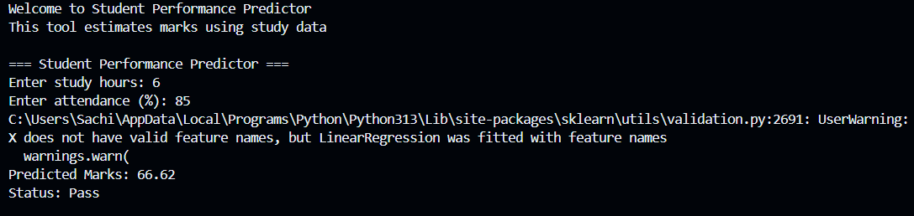

# Student Performance Predictor

It is a simple machine learning project which predicts a student's marks based on two factors: study hours and attendance. The goal of this project is to understand how basic ML models can be used to solve real-life problems. I have created this project as part of Fundamentals of AIML coursework.

## About the Project

In this project, a Linear Regression model is used to find the relationship between input features (study hours and attendance) and output (marks). After training the model on a small dataset, the program takes user input and predicts the expected marks.

## Requirements

* Python 3.13.7 installed
* Required libraries:

  * pandas
  * scikit-learn

We can install the required libraries using:

pip install -r requirements.txt

## Project Structure

- main.py → main program file  
- data.csv → dataset used for training  
- requirements.txt → dependencies  
- README.md → documentation  

## How to Run the Project

1. Open terminal in the project folder
2. Run the following command:

python main.py

3. Enter the values when asked:

   * Study hours
   * Attendance percentage

4. The program will display the predicted marks.

## Example

Input:
Study hours: 6
Attendance: 85

Output:
Predicted Marks: (value will be shown) i.e(in this example:64.06)

## Files in the Project

* main.py → contains the main program and model
* data.csv → dataset used for training
* requirements.txt → required Python libraries

## What I Learned

* Basic use of pandas for handling data
* Training a simple machine learning model
* Taking user input and making predictions
* How to structure a small project and upload it to GitHub

## Future Improvements

* Add more input features like test scores or assignments
* Use a larger dataset for better accuracy
* Add a simple interface instead of command line

---

This project is mainly for learning purposes and to understand the basics of machine learning.

## Notes

This project uses a small dataset for demonstration purposes. 
The prediction may not be highly accurate but shows how machine learning models work.

## Sample Output

## Limitations

This model is trained on a small dataset, so predictions may not be fully accurate. 
It is mainly built to demonstrate basic machine learning concepts.